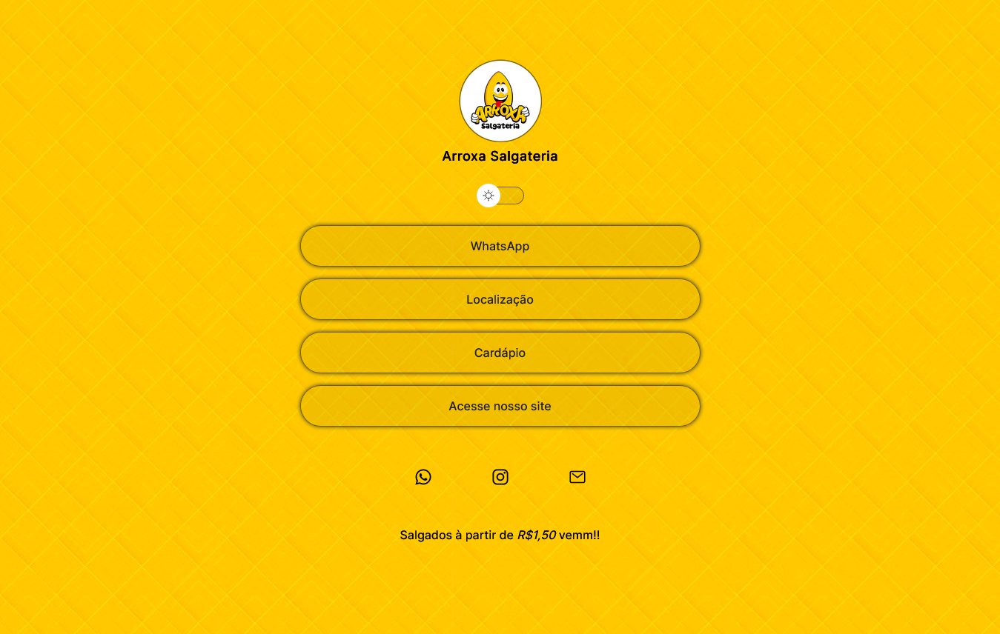

<h1 align="center"> Biolink Arroxa Salgateria </h1>

Como o Dono da Salgateria, projeto realizado com mais a cara da loja.

  <a href="#-tecnologias">Tecnologias</a>&nbsp;&nbsp;&nbsp;|&nbsp;&nbsp;&nbsp;
  <a href="#-projeto">Projeto</a>&nbsp;&nbsp;&nbsp;|&nbsp;&nbsp;&nbsp;
  <a href="#memo-licença">Licença</a>

  

 

  

## 🚀 Tecnologias

Esse projeto foi desenvolvido com as seguintes tecnologias:

- HTML  
- CSS
- JavaScript
- Figma
- Git e Github

## 💻 Projeto

Biolink do Arroxa Salgateria, é um agregador de links para usar como cartão de visitas online.

## OBS:
O menu WhatsApp e Cardápio não estão retornando, por motivos que a empresa está passando por mudanças.

## :memo: Licença

Esse projeto está sob a licença MIT.
